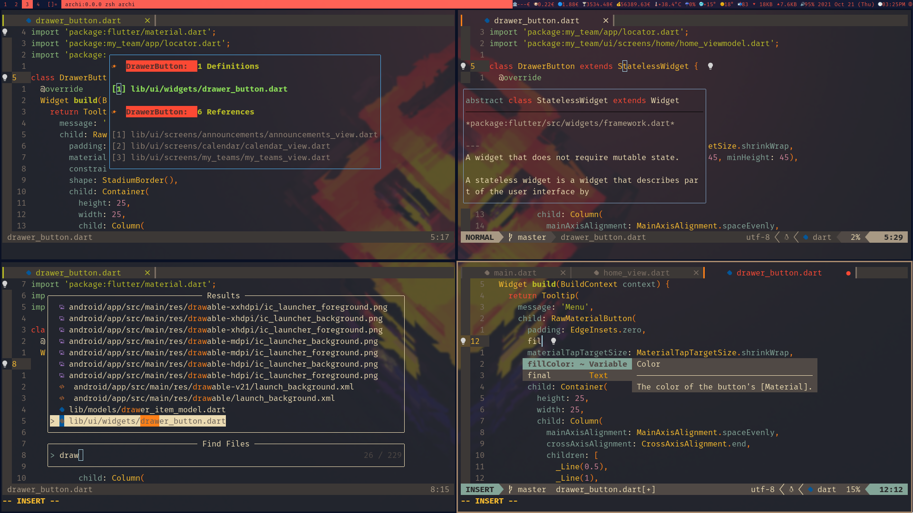

# Minimal Nvim

## Pre-requirements

- **nvim v0.5 or higher** (because of `lspsaga` you need v0.5.1+)
- npm (for most of the LSP servers)

## Features

- Native LSP
- File browser
- Status line with icons and git branch
- Buffers tabs with icons

## Quickstart

1. Clone this repo to your nvim config directory
2. Make sure you have [vim-plug](https://github.com/junegunn/vim-plug) installed
3. Run `:PlugInstall` inside nvim
4. You may need to configure some of the language servers in `lua/config.lua`
   to set the correct path for the executable (you will get an error when an
   executable is not found)
